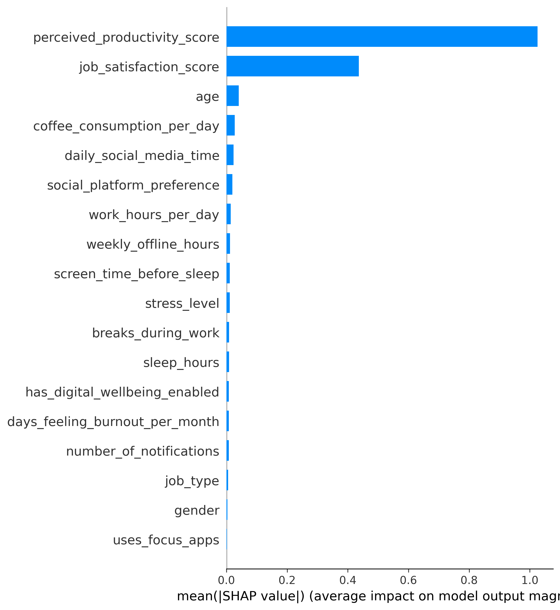

# \# Productivity Prediction Using Machine Learning


Organizations increasingly rely on productivity metrics.


This project explores whether behavioral and lifestyle factors can be used to estimate productivity scores.


1\. Can productivity be predicted accurately?


2\. Which factors influence productivity most?


3\. Are predictions fair across demographic groups?

### \# Installation

```bash
git clone <repo-url>
cd Productivity-Research

pip install -r requirements.txt
```

### \# Methodology


\- Data Cleaning

\- Feature Engineering

\- Model Training

\- Explainability Analysis

\- Fairness Analysis


### \# Models Compared


\- Linear Regression

\- Random Forest

\- XGBoost

\- LightGBM


Model			R2	RMSE	MAE

Linear Regression	0.91	0.58	0.43

Random Forest		0.92	0.52	0.40

XGBoost			0.92	0.55	0.43

LightGBM		0.92	0.52	0.40


### \# Key Findings


Stress level showed a strong negative relationship with productivity.


Sleep duration positively influenced productivity scores.


Random Forest and LightGBM achieved relatively similar but better than the rest overall predictive performance.


Model fairness remained relatively consistent across demographic groups.

### \# Results

### SHAP Feature Importance



### Correlation Heatmap


### \# Limitations


\- Data may contain self-reporting bias.


\- Dataset may not represent every profession.


\- Productivity is influenced by factors not included in the dataset.


## \# Future Work


\- Deep learning approaches


\- Time-series productivity prediction


\- Workplace-specific models


\- Causal inference studies

